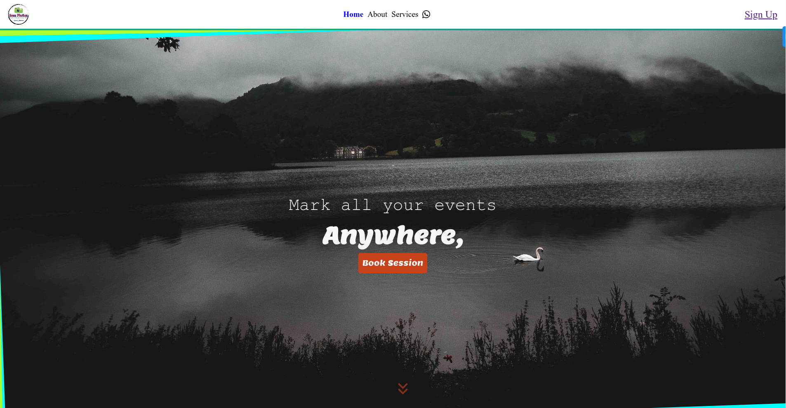

<a name="readme-top"></a>

<div style="text-align: center;">
  
  <h3><b>Joez Photozz</b></h3>
</div>


<!-- TABLE OF CONTENTS -->

# 📗 Table of Contents

- [📖 About the Project](#about-project)
- - [🛠 Built With](#built-with)
    - [Tech Stack](#tech-stack)
    - [Key Features](#key-features)
  - [🚀 Live Demo](#live-demo)
- [💻 Getting Started](#getting-started)
  - [Setup](#setup)
  - [Prerequisites](#prerequisites)
  - [Install](#install)
  - [Usage](#usage)
- [👥 Author](#author)
- [🔭 Future Features](#future-features)
- [🤝 Contributing](#contributing)
- [⭐️ Show your support](#support)
- [🙏 Acknowledgements](#acknowledgements)
- [📝 License](#license)

<!-- PROJECT DESCRIPTION -->

# 📖 Joez Photozz <a name="about-project"></a>

**Joez Photozz** is a project that was created with a goal to facilitate easy booking of booking photography and videography sessions. For the admin, it provides a collection of all bookings in one page and also giving him/her the power to cancel or confirm a booking into the schedule. An Admin can also respond to messages posted, check reviews given and reach back to contacts through the app.

## 🛠 Built With <a name="built-with"></a>

### Tech Stack <a name="tech-stack"></a>

This project is an array of 3. Comprising the **Backend**; built with NodeJS, ExpressJS and MongoDB, the **UI**; built using ReactJS and TypeScript, and the **Admin Panel** built using ReactJS and

<p align="right">(<a href="#readme-top">back to top</a>)</p>

<!-- Key Features -->

### Key Features <a name="key-features"></a>

The following features have been implemented:

- **[Hero]**
  This is an intro showcasing the company slogan and a book session button.
- **[About_Us]**
  This section provides a brief history about the company and how it came to be while also providing a gallery of recent works.
- **[Reviews]**
  This section provides a list of reviews by the various users of the app. Anyone with an account on the site can give a review.
- **[Contact_Us]**
  This section provides a form that allows the user to contact the team with a message to relay.
- **[Booking_Form_Popup]**
  This is a popup that opens up on the click of the Book Session Button. This popup has a form that allows for a registered user to create a booking by providing various requirements like the type of session, the date, and location.
- **[Reviews_Form_Popup]**
  This is a popup that opens up onClick of the AddReview button and provides a form for review information collection.

<p align="right">(<a href="#readme-top">back to top</a>)</p>

<!-- LIVE DEMO -->

## 🚀 Live Demo <a name="live-demo"></a>



> Will be provided soon

<p align="right">(<a href="#readme-top">back to top</a>)</p>

<!-- Video Walkthrough -->

## Video Walkthrough <a name="outline-video"></a>

> Will be provided soon.

<p align="right">(<a href="#readme-top">back to top</a>)</p>

<!-- GETTING STARTED -->

## 💻 Getting Started <a name="getting-started"></a>

To get a local copy up and running, follow these steps.

### Prerequisites <a name="prerequisites" ></>

In order to set up a local copy of this repository, you need to have git installed:

[Install Git](https://git-scm.com/book/en/v2/Getting-Started-Installing-Git) <a name="install"></a>

### Setup <a name="setup"></a>

Clone this repository to your desired folder:

Example commands:

```sh
  mkdir my-folder
  cd my-folder
  git clone https://github.com/Bennyjoez/joezz_photozz.git
  cd joezz_photozz
  npm install
```

-

### Usage <a name="usage"></a>

To run the project:

Ensure the [backend](https://github.com/Bennyjoez/joezz_photozz_backend.git) is setup properly and proceed.
Run **npm run dev**

## Rules of Engagement

1. A client needs to be logged in to make a booking.
2. A client needs to be logged in to submit a review.
3. A client doesn't need to be logged in to contact the team.

<!-- AUTHORS -->

## 👥 Authors <a name="author"></a>

👤 **Benson Njuguna**

- GitHub: [@bennyjoez](https://github.com/bennyjoez)
- Twitter: [@bennnyjoez](https://twitter.com/bennnyjoez)

<p align="right">(<a href="#readme-top">back to top</a>)</p>

<!-- FUTURE FEATURES -->

## 🔭 Future Features <a name="future-features"></a>

I plan to add the following features:

1. **[Admin_Panel]**

<p align="right">(<a href="#readme-top">back to top</a>)</p>

<!-- CONTRIBUTING -->

## 🤝 Contributing <a name="contributing"></a>

Contributions, issues, and feature requests are welcome!

Feel free to check the [issues page](https://github.com/Bennyjoez/joezz_photozz/issues).

<p align="right">(<a href="#readme-top">back to top</a>)</p>

<!-- SUPPORT -->

## ⭐️ Show your support <a name="support"></a>

If you like this project, you can show your support by giving this project's repository a star on github.

<p align="right">(<a href="#readme-top">back to top</a>)</p>

<!-- ACKNOWLEDGEMENTS -->

## 🙏 Acknowledgments <a name="acknowledgements"></a>

I would like to thank the following for making the resources and reviews on the project:

1. <a href="https://www.freepik.com/free-ai-image/3d-rendering-camera-with-photo-film_94958810.htm#query=book%20session%20photography%20canon%20mark%20iii&position=5&from_view=search&track=ais_ai_generated&uuid=18e045ae-3bf0-467e-9eb5-3a4d979e0345">Image By freepik</a>

<!-- LICENSE -->

## 📝 License <a name="license"></a>

This project is [MIT](https://github.com/Bennyjoez/joezz_photozz/blob/224a2cb581a64a7c8c2f1ff2be496e1990f91491/LICENSE) licensed.

<p align="right">(<a href="#readme-top">back to top</a>)</p>
